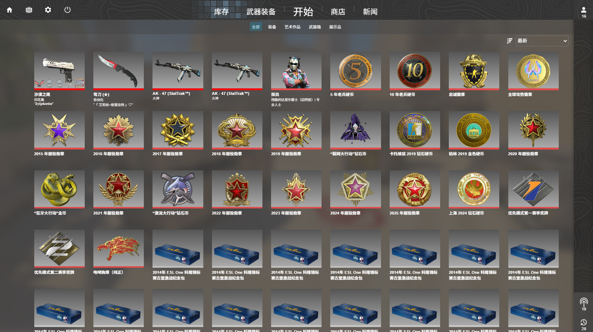
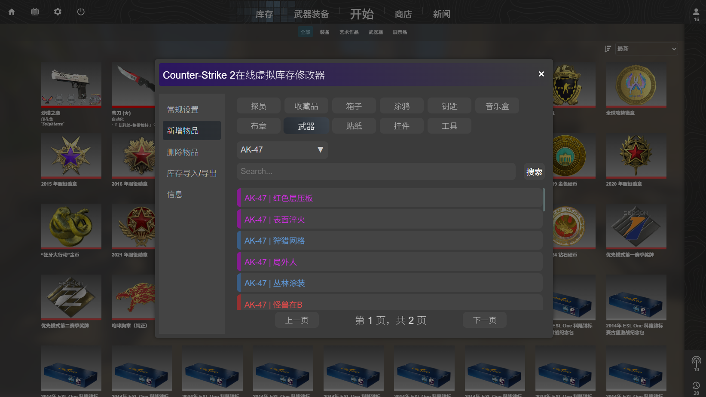

## 项目介绍

这是一个基于 JavaScript 高仿 Counter-Skrike 2 库存的项目。

## 启动项目

使用浏览器打开 index.html 文件即可启动项目基础功能。
启动 /proxy/server.js 即可启用代理服务器，用于获取 Steam 用户信息。
注意：您需要在浏览器里设置允许自动播放视频，否则启动动画会出现问题

## 功能介绍

- 通过 INS 键调出菜单，支持添加、删除库存物品，设置用户头像

## 未来计划

- 加载、保存库存存档的功能
- 模拟开箱
- 模拟汰换
- 新物品入库检视
- 物品检视
- 模拟控制台
- 完善其他页面

## 数据获取

数据来自于 CSGO-API : https://github.com/ByMykel/CSGO-API  

### images文件夹

我写的自动获取图像的脚本仍有问题，需要手动通过 CSGO-API 获取数据。
除了四张图片外，还应有 **icon** , **panorama** 文件夹，他们的结构见下文 **images文件夹结构**

### data文件夹

其中的json文件夹应有 **all.json** 和 **tabel.json**  

**all.json** 是通过 **update.js** 从 **CSGO-API** 中获取的信息。  
**tabel.json** 是通过 **update.js** 从 **all.json** 中提取的信息。

## images文件夹结构

images  
├── icon 游戏主页面svg图标  
└── panorama  
&emsp;└── images  
&emsp;&emsp;└── econ  
&emsp;&emsp;&emsp;└── characters   
&emsp;&emsp;&emsp;└── default_generated  
&emsp;&emsp;&emsp;└── keychains   
&emsp;&emsp;&emsp;└── music_kits   
&emsp;&emsp;&emsp;└── patches    
&emsp;&emsp;&emsp;└── premier_seasons     
&emsp;&emsp;&emsp;└── season_icons   
&emsp;&emsp;&emsp;└── set_icons    
&emsp;&emsp;&emsp;└── status_icons    
&emsp;&emsp;&emsp;└── stickers     
&emsp;&emsp;&emsp;└── tools     
&emsp;&emsp;&emsp;└── tournaments   
&emsp;&emsp;&emsp;└── weapon_cases    
&emsp;&emsp;&emsp;└── weapons     
&emsp;&emsp;&emsp;└── wearables    
&emsp;└──panorama \ images \ econ \ wearables \ gloves
